Задание по гиту

1.

Вводим команду git init  
 

2. 

Вводим команду git add test.txt  

 

3.

Вводим команду git commit -m "Первый коммит" 
 

4.

Вводим команду git log 

 

5.1

Вводим команду git diff 
 

Ничего не выводится, т.к. изначально репозиторий пустой.
Создали репозиторий в гитхабе и соединили его с локальным репозиторием.

5.2

Добавили изменения в файл test.txt

Вводим команду git diff 
 

6.

Вводим команду git checkout -- test.txt 
 

Из файла пропали строчки 
 

7.
Вводи команду git branch develop для создания ветки develop
И git branch для вывода всех текущих веток 
 

8.

Вводим команду git checkout develop
и git branch для вывода всех текущих веток 
 

9.
На ветке деволоп добавили изменения в файл test.txt и запушим их в репозиторий с помощью git add test.txt, git commit -m "Коммит 4" и git push origin develop
Переключимся на ветку main: git checkout main

Сделаем слияыние ветки develop в main: git merge develop 
 

10.
Удалим ветку develop: git branch -d develop 
 

11.
Вводим команду git commit --amend -m "Меняем коммит" 
 

12.
Добавим новый файл test_2.txt в репозиторий
и удалим его из репозитория с помощью git rm test_2.txt 
 

13.
Создаем фалй .gitignore в корне репозитория 
 

И помещаем туда строку hello.txt
Сделаем добавление файла в репозиторий с помощью git add hello.txt 
 

14.
Создаем ветку develop с помощью git branch develop
Переключимся на ветку develop: git checkout develop
Добавим файл develop.txt в репозиторий с помощью git add develop.txt

Вводим команду git diff main develop 
 

15.
Изменим содержимое файла develop.txt и добавим его в репозиторий с помощью git add develop.txt
Вводим команду git reset HEAD develop.txt 
 

16.

Вводим команду git status чтобы проверить статус репозитория 
 

17.
Вводим команду git mv develop.txt new_develop.txt чтобы переименовать файл develop.txt в new_develop.txt 
 

18.
Вводим команду git show "id коммита" чтобы посмотреть содержимое коммита 
 

19.
Переключаемся на другой коммит с помощью команды git checkout "id коммита" 
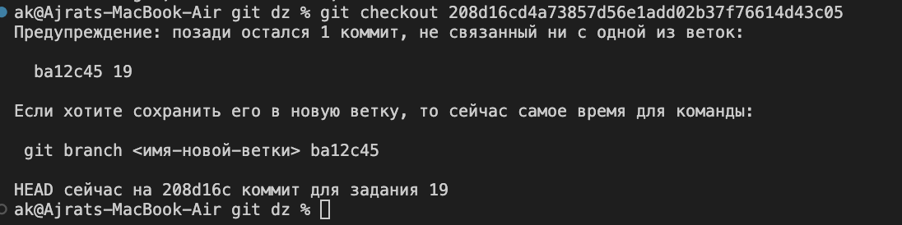 

20.
Вводим команду git log --oneline чтобы посмотреть список коммитов и команду git format-patch HEAD^..HEAD
Теперь сделаем новый коммит с помощью команды git commit -a -m "Новый коммит" и вводим git apply 0001-19.patch 
 

21.
Вводим команду для интерактивного ребейза последних двух коммитов: git rebase -i HEAD~2

22.
Вводим команду git commit --amend --author="New Author <new.author@example.com>" --no-edit 
 

23.
Созает ветку feature делаем там коммит, переключаемся на main и сделаем там изменение, переключаемся обратно на feature и делаем rebase 
 

24.
Делаем ноаый коммит в main test.txt, делаем git stash смотрим что изменение спрятолось и делаем возврат git stash apply 
 

25.
Создаем ветку feature и делаем коммит в ней test.txt
Переключаемся на main и делаем cherry-pick с помощью id коммита 
 

26.
Вводим команду git branch и git remote -v для проверки соединения с удаленным репозиторием и вывода всех веток 
 

27.
Вводим git remote -v
git remote set-url origin и вводим новый адрес удаленного репозитория

28.
Вводим git reset --soft HEAD~1 
 

Вводим git rebase -i HEAD~2
И удаляем ненужный коммит

29.
Вводим команду git config --global alias.st "status" чтобы иметь сокращенную команду

30.

git submodule add "URL-gita" submodule-folder
git submodule init
git submodule update

Удаленный репозиторий

1. 
Пишем git clone "URL репозитория"
пишем ls чтобы убедиться что папка создана

2.
git remote add new-origin "URL репозитория"
Добавить новый удалённый репозиторий

3.
git remote -v  
 

4.
Вводим git remote show origin  
 

5.
Вводим git remote set-url origin "URL репозитория"  

6.
Вводим git add фото/  git commit "task 6" git push чтобы отправить изменения на удалённый репозиторий 
 

7.
Вводим git add доклад_2.md и git commit -m "task 7" git push чтобы отправить изменения на удалённый репозиторий 
 

8.
Добавляем новый файл new-file.txt пишем:
git dff
git add new-file.txt
git commit -m "Локальное изменение в new-file.txt"
git fetch origin
git diff origin/main main
И сравниваем локальную версию с удалённой версией
 

9.
Вводим git fetch origin чтобы получить изменения удалённого репозитория 
git log --oneline --graph --all чтобы посмотреть изменения удалённого репозитория 
git pull origin main чтобы скачать изменения удалённого репозитория 
 

10.
Вводим git branch -r чтобы посмотреть все ветки удалённого репозитория 
Вводим git push origin --delete develop чтобы удалить ветку develop удалённого репозитория 
git branch -r  чтобы посмотреть все ветки удалённого репозитория 
 

11.
Переимновыем удаленные ветки git branch -m, git push origin :old_branch_name new_branch_name 
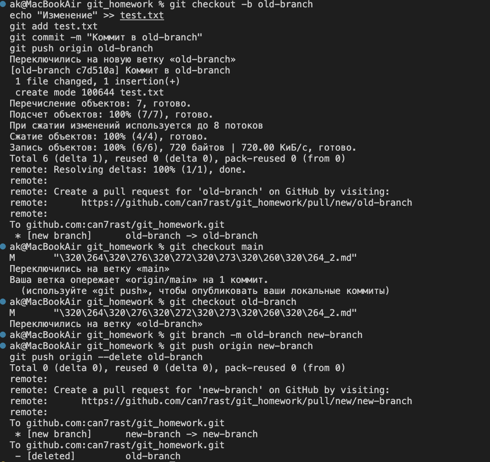 

12.
git branch -m, git push origin :old_branch_name new_branch_name

13.
Вводим:
git checkout -b source-branch
echo "Изменение" >> test.txt
git add test.txt
git commit -m "Коммит в source-branch"
git push origin source-branch

git push origin source-branch:destination-branch

git branch -r 
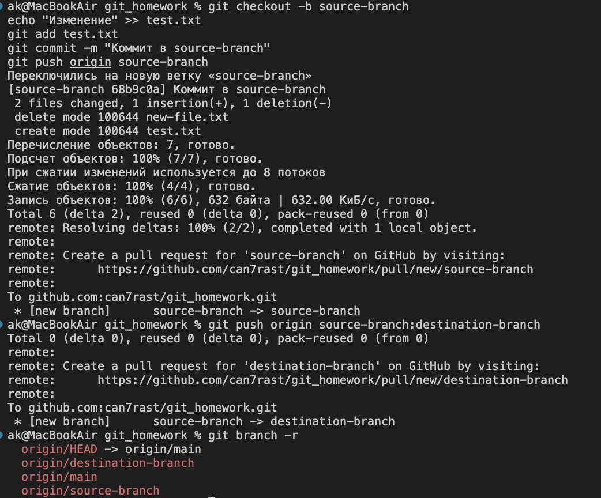 

14.
Вводим git tag v1.0
git push origin --tags
git tag
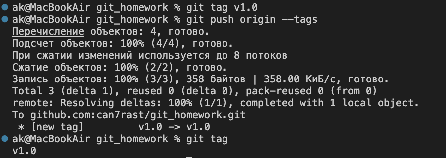 

15.
Вводим git tag
git tag -d v1.0
git push origin --delete v1.0
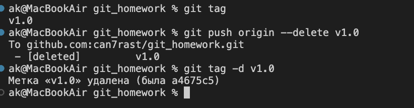 

16.
Вводим
git fetch origin чтобы получить изменения удалённого репозитория
git log --oneline origin/main Просмотреть историю коммитов для удалённой ветки
 

17.
Создаем тестовый коммит
echo "Тестовый коммит" >> test.txt
git add test.txt
git commit -m "Тестовый коммит"
git push origin main

Отменяем тестовый коммит
git reset --soft HEAD~1

Принудительно отправляем изменения
git push -f origin main  
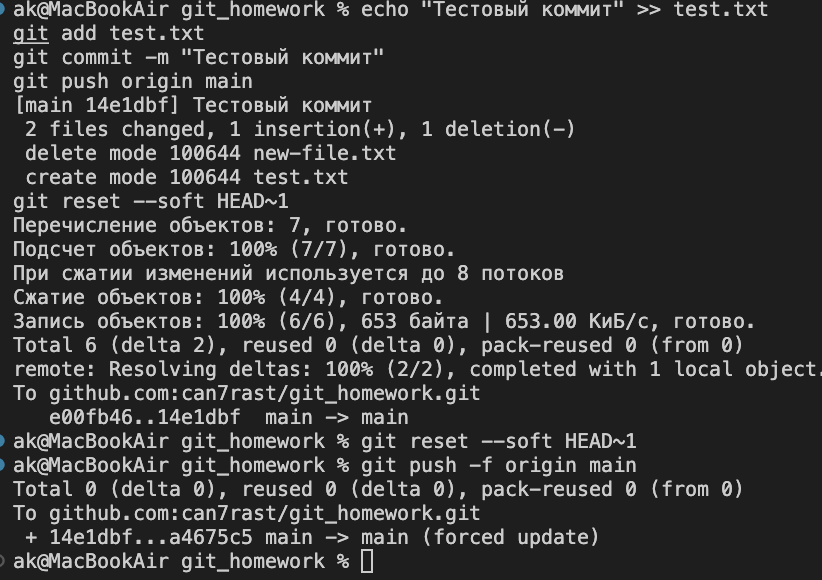 

18.
git branch -r чтобы посмотреть все ветки удалённого репозитория

19.
git remote -v чтобы посмотреть информацию об удалённом репозитории
git remote set-url upstream "URL репозитория" для установки нового адреса удалённого репозитория

20.
git remote -v чтобы посмотреть информацию об удалённом репозитории
делимся с коллегой ссылкой на удалённый репозиторий

21.
git fetch
git branch -r чтобы посмотреть все ветки удалённого репозитория
 
 

22.

git remote -v
Шаг 2: Перейти в интерфейс платформы (например, GitHub)
Откройте браузер и перейдите по URL
Перейдите в раздел Settings > Collaborators and teams
Добавьте или измените права доступа для пользователей или команд

23.
Вводим git fetch
git log --format="%an <%ae>" origin/main | sort -u чтобы посмотреть список владельцев удалённой ветки
 

24.
Шаг 1: Создать тестовый коммит
echo "Тестовое изменение" >> test.txt
git add test.txt
git commit -m "Старое сообщение"
git push origin main

Шаг 2: Изменить сообщение коммита
git commit --amend -m "Новое сообщение коммита" 
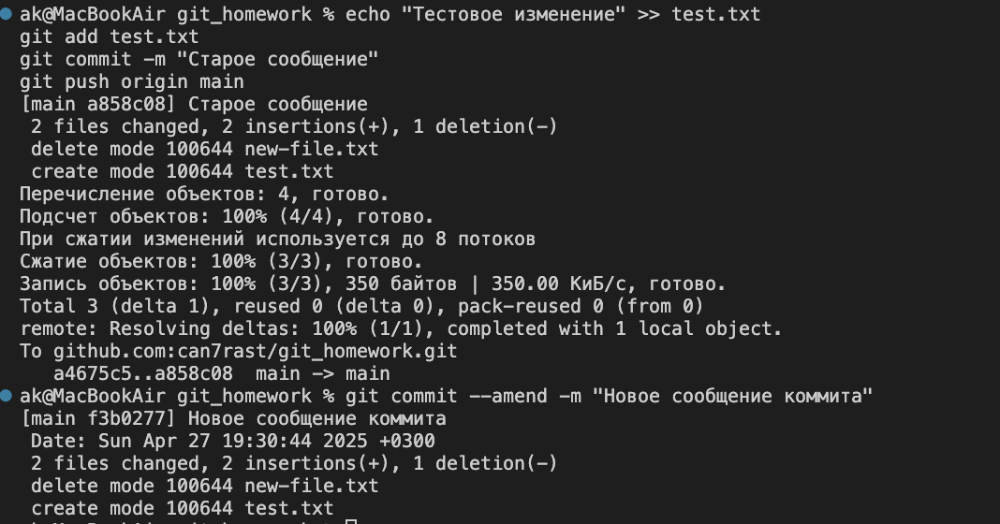 

25.
Шаг 1: Внести изменения в локальную ветку
echo "Локальное изменение" >> test.txt
git add test.txt
git commit -m "Локальное изменение"

Шаг 2: Загрузить данные из удалённого репозитория
git fetch origin

Шаг 3: Сравнить локальную и удалённую ветки
git diff origin/main main 
 

26.
git rm test.txt
git commit -m "Удаление файла test.txt"
git push origin main  
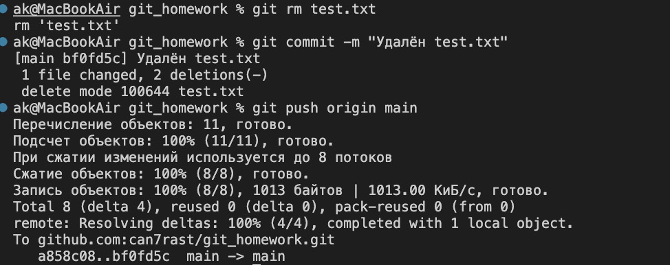 

27.
git log --oneline -- test.txt
git checkout <commit_id> -- test.txt вернули коммит с test.txt  
 

28.
git checkout -b new-branch
echo "Новое изменение" >> feature.txt
git add feature.txt
git commit -m "Добавлен feature.txt в new-branch"
git push origin new-branch
git branch -r
Создали ветку new-branch и переключились на неё
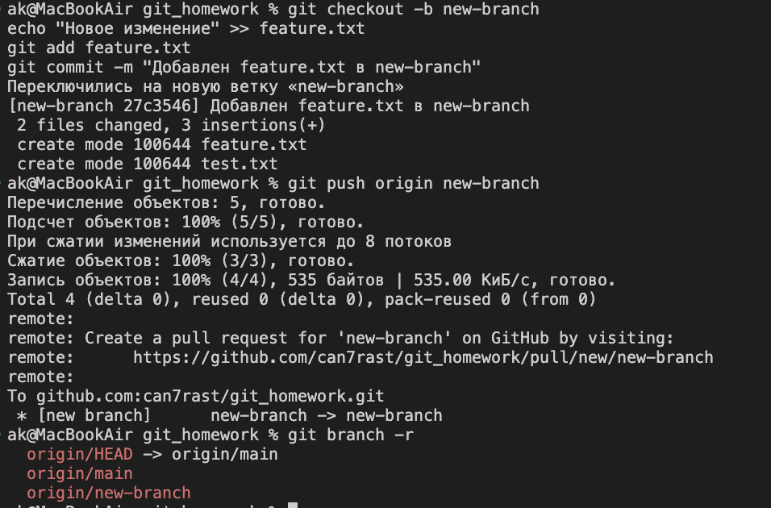 

29.
git fetch origin --tags
git tag
git show v1.0 
 

30.
 Шаг 1: Загрузить данные из удалённого репозитория, включая теги
git fetch origin --tags

 Шаг 2: Сравнить два тега или коммита
git diff origin/v1.0 origin/v2.0

31.
 Шаг 1: Убедиться, что есть коммит
git log --oneline -1

 Шаг 2: Изменить сообщение последнего коммита
git commit --amend -m "Обновлённое сообщение коммита"

 Шаг 3: Принудительно отправить изменения
git push -f origin main

 Шаг 4: Проверить историю
git log --oneline -1  
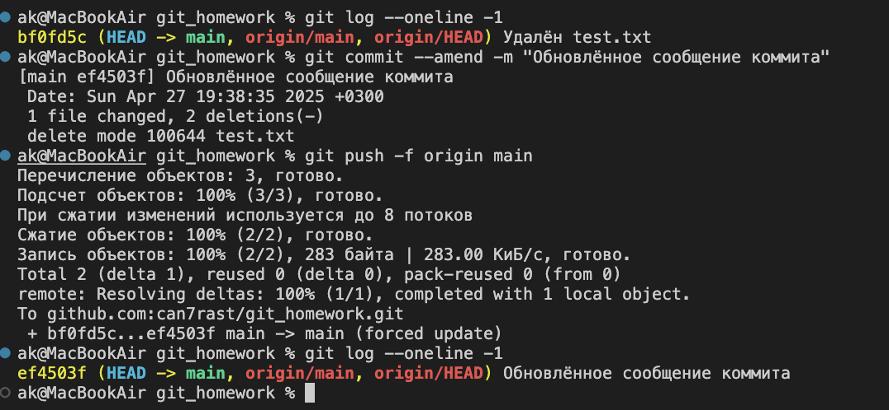 

32.
 Шаг 1: Создать тестовый коммит
echo "Тестовое изменение" >> feature.txt
git add feature.txt
git commit -m "Тестовый коммит"

 Шаг 2: Отменить последний коммит
git reset --soft HEAD^

 Шаг 3: Проверить статус
git status

 Шаг 4: Проверить историю
git log --oneline 
 

33.
 Шаг 1: Переименовать файл
git mv feature.txt new-feature.txt

 Шаг 2: Закоммитить изменение
git commit -m "Переименован feature.txt в new-feature.txt" 
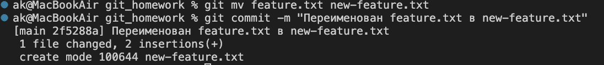 

34.
git remote show origin 
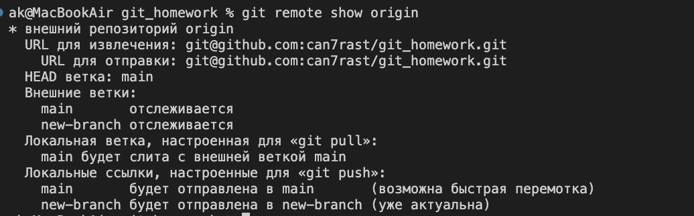 

35.
 Шаг 1: Проверить существующие удалённые ветки
git branch -r

 Шаг 2: Удалить ветку из удалённого репозитория
git push origin --delete new-branch

 Шаг 3: Проверить, что ветка удалена
git branch -r 
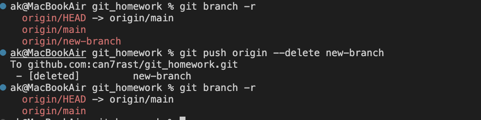 

36.
 Шаг 1: Внести изменения для примера
echo "Ожидающее изменение" >> feature.txt
git add feature.txt
git commit -m "Ожидающий коммит"

 Шаг 2: Проверить статус изменений
git status

 Шаг 3: (Опционально) Проверить, что коммит не отправлен
git log origin/main..main --oneline 
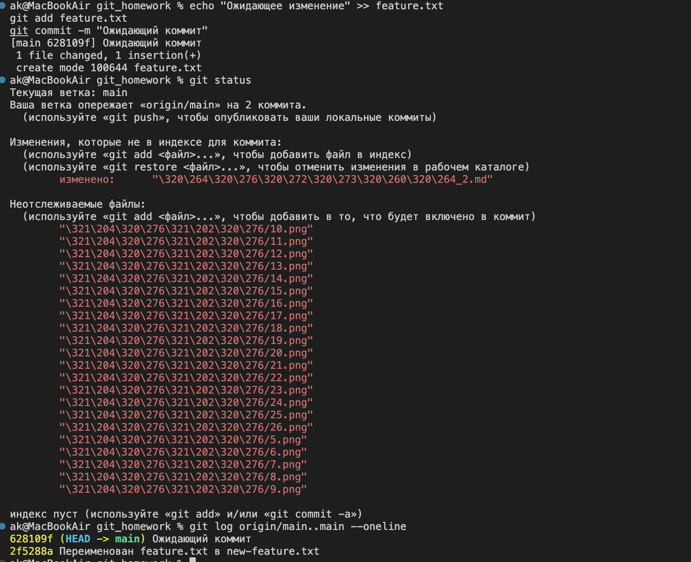 

37.
 Шаг 1: Внести незакоммиченные изменения для примера
echo "Локальное изменение" >> feature.txt

 Шаг 2: Отменить незакоммиченные изменения
git checkout -- feature.txt

 Шаг 3: Загрузить данные из удалённого репозитория
git fetch origin

 Шаг 4: Сбросить локальную ветку до состояния удалённой
git reset --hard origin/main

 Шаг 5: Проверить статус
git status

38.
 Шаг 1: Переключиться на существующую ветку (или создать новую)
git checkout new-branch

 Шаг 2: Обновить ветку из удалённого репозитория
git pull origin new-branch

39.
 Шаг 1: Создать коммит на текущей ветке
echo "Изменение для переноса" >> feature.txt
git add feature.txt
git commit -m "Коммит для переноса"

 Шаг 2: Создать новую ветку для переноса
git checkout -b target-branch

 Шаг 3: Перенести коммит с помощью cherry-pick
git cherry-pick main
 Если cherry-pick вызывает конфликт, разрешите его, затем:
 git add <файл>
 git cherry-pick --continue

 Шаг 4: Отправить новую ветку в удалённый репозиторий
git push origin target-branch

 Шаг 5: (Опционально) Удалить коммит из main
git checkout main
git reset --hard HEAD^

 Шаг 6: Отправить изменения в main
git push origin main

40.
 Шаг 1: Создать тестовые коммиты
echo "Коммит 1" >> feature.txt
git add feature.txt
git commit -m "Коммит 1"
echo "Коммит 2" >> feature.txt
git add feature.txt
git commit -m "Коммит 2"

 Шаг 2: Изменить историю коммитов
git rebase -i HEAD~2
 В открывшемся редакторе переставьте строки коммитов или измените команды (например, squash для объединения)
 Сохраните и закройте редактор

 Шаг 3: Принудительно отправить изменения
git push -f origin main

 Шаг 4: Проверить историю
git log --oneline

41.
 Шаг 1: Загрузить данные из удалённого репозитория
git fetch origin

 Шаг 2: Найти ID коммитов
git log --oneline origin/main

 Шаг 3: Сравнить два коммита
git diff <commit_id1> <commit_id2>  
 

42.
 Шаг 1: Создать локальную ветку (если нужно)
git checkout -b feature-branch
echo "Изменение" >> feature.txt
git add feature.txt
git commit -m "Коммит в feature-branch"
git push origin feature-branch

 Шаг 2: Настроить отслеживание удалённой ветки
git branch --set-upstream-to=origin/feature-branch

 Шаг 3: Проверить настройки отслеживания
git branch -vv 
 

43.
 Шаг 1: Загрузить данные из удалённого репозитория
git fetch origin

 Шаг 2: Просмотреть список вкладчиков через историю коммитов
git log --format="%an <%ae>" origin/main | sort -u 
 

44.
 Шаг 1: Загрузить данные из удалённого репозитория
git fetch origin

 Шаг 2: Просмотреть список удалённых веток
git branch -r 
 

45.
 Шаг 1: Создать тег (если его нет)
git tag v2.0

 Шаг 2: Отправить все теги в удалённый репозиторий
git push origin --tags

 Шаг 3: Проверить теги
git tag 
 

46.
 Шаг 1: Проверить URL репозитория для доступа к настройкам
git remote -v

 Шаг 2: Перейти в интерфейс платформы
 - Откройте браузер и перейдите, например, https://github.com/user/repo
 - Перейдите в раздел Settings
 - Измените параметры (например, название репозитория, описание или видимость)

47.
 Шаг 1: Внести изменения в локальную ветку
echo "Локальное изменение" >> feature.txt
git add feature.txt
git commit -m "Локальное изменение"

 Шаг 2: Загрузить данные из удалённого репозитория
git fetch origin

 Шаг 3: Сравнить локальную и удалённую ветки
git diff main origin/main 
 

48.
 Шаг 1: Создать тестовый коммит
echo "Тестовое изменение" >> feature.txt
git add feature.txt
git commit -m "Старое сообщение"

 Шаг 2: Изменить сообщение коммита
git commit --amend -m "Новое сообщение коммита"

 Шаг 3: Проверить историю
git log --oneline -1

49.
 Шаг 1: Загрузить данные из удалённого репозитория
git fetch origin

 Шаг 2: Просмотреть список удалённых веток
git branch -r

 Шаг 3: Восстановить удалённую ветку локально
git checkout -b feature-branch origin/feature-branch

50.
 Шаг 1: Просмотреть ссылки в удалённом репозитории
git ls-remote origin

 Шаг 2: Просмотреть подробную информацию об удалённом репозитории
git remote show origin 
 