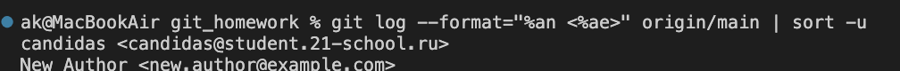

1. 
Пишем git clone "URL репозитория"
пишем ls чтобы убедиться что папка создана

2.
git remote add new-origin "URL репозитория"
Добавить новый удалённый репозиторий

3.
git remote -v  
 

4.
Вводим git remote show origin  
 

5.
Вводим git remote set-url origin "URL репозитория"  

6.
Вводим git add фото/  git commit "task 6" git push чтобы отправить изменения на удалённый репозиторий 
 

7.
Вводим git add доклад_2.md и git commit -m "task 7" git push чтобы отправить изменения на удалённый репозиторий 
 

8.
Добавляем новый файл new-file.txt пишем:
git dff
git add new-file.txt
git commit -m "Локальное изменение в new-file.txt"
git fetch origin
git diff origin/main main
И сравниваем локальную версию с удалённой версией
 

9.
Вводим git fetch origin чтобы получить изменения удалённого репозитория 
git log --oneline --graph --all чтобы посмотреть изменения удалённого репозитория 
git pull origin main чтобы скачать изменения удалённого репозитория 
 

10.
Вводим git branch -r чтобы посмотреть все ветки удалённого репозитория 
Вводим git push origin --delete develop чтобы удалить ветку develop удалённого репозитория 
git branch -r  чтобы посмотреть все ветки удалённого репозитория 
 

11.
Переимновыем удаленные ветки git branch -m, git push origin :old_branch_name new_branch_name 
 

12.
git branch -m, git push origin :old_branch_name new_branch_name

13.
Вводим:
git checkout -b source-branch
echo "Изменение" >> test.txt
git add test.txt
git commit -m "Коммит в source-branch"
git push origin source-branch

git push origin source-branch:destination-branch

git branch -r 
 

14.
Вводим git tag v1.0
git push origin --tags
git tag
 

15.
Вводим git tag
git tag -d v1.0
git push origin --delete v1.0
 

16.
Вводим
git fetch origin чтобы получить изменения удалённого репозитория
git log --oneline origin/main Просмотреть историю коммитов для удалённой ветки
 

17.
Создаем тестовый коммит
echo "Тестовый коммит" >> test.txt
git add test.txt
git commit -m "Тестовый коммит"
git push origin main

Отменяем тестовый коммит
git reset --soft HEAD~1

Принудительно отправляем изменения
git push -f origin main  
 

18.
git branch -r чтобы посмотреть все ветки удалённого репозитория

19.
git remote -v чтобы посмотреть информацию об удалённом репозитории
git remote set-url upstream "URL репозитория" для установки нового адреса удалённого репозитория

20.
git remote -v чтобы посмотреть информацию об удалённом репозитории
делимся с коллегой ссылкой на удалённый репозиторий

21.
git fetch
git branch -r чтобы посмотреть все ветки удалённого репозитория
 
 

22.

git remote -v
Шаг 2: Перейти в интерфейс платформы (например, GitHub)
Откройте браузер и перейдите по URL
Перейдите в раздел Settings > Collaborators and teams
Добавьте или измените права доступа для пользователей или команд

23.
Вводим git fetch
git log --format="%an <%ae>" origin/main | sort -u чтобы посмотреть список владельцев удалённой ветки
 

24.
Шаг 1: Создать тестовый коммит
echo "Тестовое изменение" >> test.txt
git add test.txt
git commit -m "Старое сообщение"
git push origin main

Шаг 2: Изменить сообщение коммита
git commit --amend -m "Новое сообщение коммита" 
 

25.
Шаг 1: Внести изменения в локальную ветку
echo "Локальное изменение" >> test.txt
git add test.txt
git commit -m "Локальное изменение"

Шаг 2: Загрузить данные из удалённого репозитория
git fetch origin

Шаг 3: Сравнить локальную и удалённую ветки
git diff origin/main main 
 

26.
git rm test.txt
git commit -m "Удаление файла test.txt"
git push origin main  
 

27.
git log --oneline -- test.txt
git checkout <commit_id> -- test.txt вернули коммит с test.txt  
 

28.
git checkout -b new-branch
echo "Новое изменение" >> feature.txt
git add feature.txt
git commit -m "Добавлен feature.txt в new-branch"
git push origin new-branch
git branch -r
Создали ветку new-branch и переключились на неё
 

29.
git fetch origin --tags
git tag
git show v1.0 
 

30.
# Шаг 1: Загрузить данные из удалённого репозитория, включая теги
git fetch origin --tags

# Шаг 2: Сравнить два тега или коммита
git diff origin/v1.0 origin/v2.0

31.
# Шаг 1: Убедиться, что есть коммит
git log --oneline -1

# Шаг 2: Изменить сообщение последнего коммита
git commit --amend -m "Обновлённое сообщение коммита"

# Шаг 3: Принудительно отправить изменения
git push -f origin main

# Шаг 4: Проверить историю
git log --oneline -1  
 

32.
# Шаг 1: Создать тестовый коммит
echo "Тестовое изменение" >> feature.txt
git add feature.txt
git commit -m "Тестовый коммит"

# Шаг 2: Отменить последний коммит
git reset --soft HEAD^

# Шаг 3: Проверить статус
git status

# Шаг 4: Проверить историю
git log --oneline 
 

33.
# Шаг 1: Переименовать файл
git mv feature.txt new-feature.txt

# Шаг 2: Закоммитить изменение
git commit -m "Переименован feature.txt в new-feature.txt" 
 

34.
git remote show origin 
 

35.
# Шаг 1: Проверить существующие удалённые ветки
git branch -r

# Шаг 2: Удалить ветку из удалённого репозитория
git push origin --delete new-branch

# Шаг 3: Проверить, что ветка удалена
git branch -r 
 

36.
# Шаг 1: Внести изменения для примера
echo "Ожидающее изменение" >> feature.txt
git add feature.txt
git commit -m "Ожидающий коммит"

# Шаг 2: Проверить статус изменений
git status

# Шаг 3: (Опционально) Проверить, что коммит не отправлен
git log origin/main..main --oneline 
 

37.
# Шаг 1: Внести незакоммиченные изменения для примера
echo "Локальное изменение" >> feature.txt

# Шаг 2: Отменить незакоммиченные изменения
git checkout -- feature.txt

# Шаг 3: Загрузить данные из удалённого репозитория
git fetch origin

# Шаг 4: Сбросить локальную ветку до состояния удалённой
git reset --hard origin/main

# Шаг 5: Проверить статус
git status

38.
# Шаг 1: Переключиться на существующую ветку (или создать новую)
git checkout new-branch

# Шаг 2: Обновить ветку из удалённого репозитория
git pull origin new-branch

39.
# Шаг 1: Создать коммит на текущей ветке
echo "Изменение для переноса" >> feature.txt
git add feature.txt
git commit -m "Коммит для переноса"

# Шаг 2: Создать новую ветку для переноса
git checkout -b target-branch

# Шаг 3: Перенести коммит с помощью cherry-pick
git cherry-pick main
# Если cherry-pick вызывает конфликт, разрешите его, затем:
# git add <файл>
# git cherry-pick --continue

# Шаг 4: Отправить новую ветку в удалённый репозиторий
git push origin target-branch

# Шаг 5: (Опционально) Удалить коммит из main
git checkout main
git reset --hard HEAD^

# Шаг 6: Отправить изменения в main
git push origin main